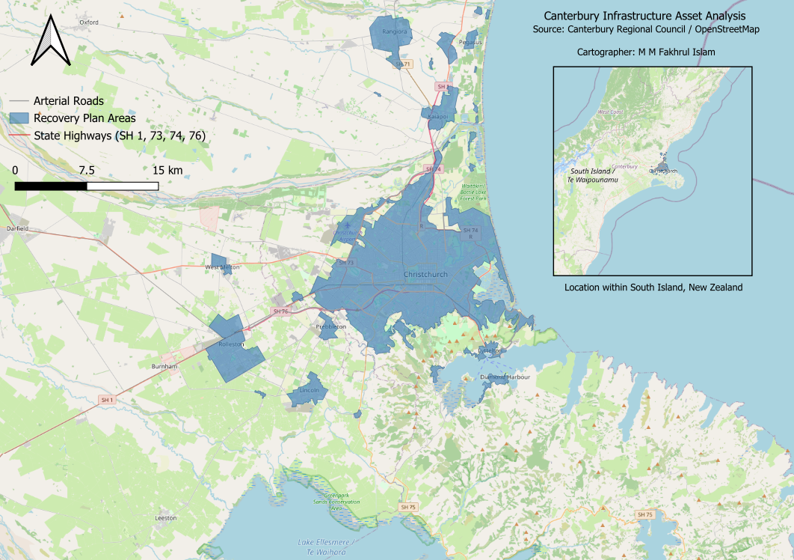

# Canterbury Infrastructure Asset Analysis

A comprehensive cartographic and spatial analysis visualizing critical infrastructure networks and recovery plan areas across the Canterbury region, New Zealand.

---

## Project Overview

This GIS mapping project illustrates regional transport corridors, infrastructure assets, and spatial planning focus zones within Canterbury. It is designed to provide clear visual insights into urban and regional connectivity.

---

## Key Findings

* **Key Infrastructure Network:** Mapped major regional transport corridors, including state highways (SH1, SH3, SH73, SH74, SH76) and arterial road networks across Canterbury.
* **Recovery Plan Integration:** Visualized designated recovery plan areas to highlight spatial planning focus zones within the region.
* **Regional Contextualization:** Incorporated an inset overview locator map to accurately frame the study area within the broader context of the South Island, New Zealand.

---

## Map Preview

---

## Tools & Sources

* **Tools:** QGIS
* **Sources:** Canterbury Regional Council • OpenStreetMap

---

## Author

**M M Fakhrul Islam**
